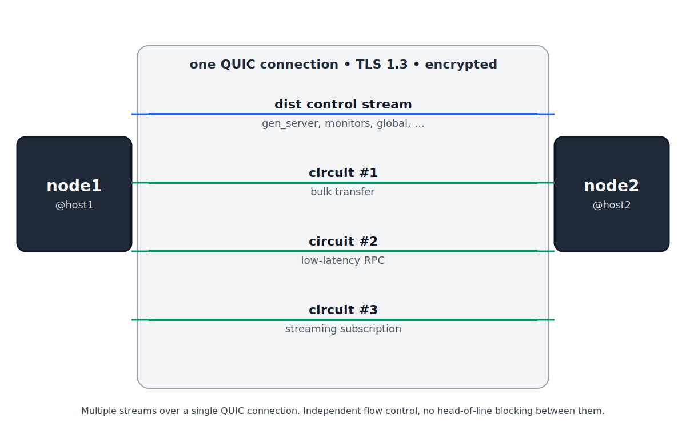

<!-- LinkedIn Article version. The editor accepts headings (toolbar),
     bold, lists, links and inline images. It does not parse markdown.
     Code samples below use the toolbar's "Code" formatter, or upload
     them as image. The diagram is docs/images/quic_dist_circuits.svg
     (LinkedIn auto-converts SVG on upload). -->

# erlang_quic: a pure-Erlang QUIC and HTTP/3 stack

Today I am publishing erlang_quic 1.3.0, the first production-ready
release of a pure-Erlang implementation of QUIC and HTTP/3. The library
implements RFC 9000 / 9001 (QUIC), RFC 9114 (HTTP/3), RFC 9204 (QPACK),
and the priority and datagram extensions (RFC 9218 and 9297). It has no
external dependencies and runs on stock OTP 27 or newer.

The same codebase exposes both layers as first-class APIs. A QUIC server
is one function call, and an HTTP/3 server on top of it is one function
more.

```erlang
{ok, _} = quic:start_server(my_server, 4433, #{
    cert => Cert,
    key  => Key,
    alpn => [<<"h3">>]
}).

{ok, _} = quic_h3:start_server(my_h3, 4433, #{
    cert => Cert,
    key  => Key,
    handler => fun(Conn, StreamId, Method, Path, Headers) ->
        quic_h3:send_response(Conn, StreamId, 200,
            [{<<"content-type">>, <<"text/plain">>}]),
        quic_h3:send_data(Conn, StreamId, <<"OK">>, true)
    end
}).
```

## The protocol surface

The transport layer covers RFC 9000 version 1 with TLS 1.3 via RFC 9001:
header protection, the three packet-number spaces, RFC 9002 loss
recovery, three congestion controllers (NewReno, Cubic, BBR), stateless
reset, connection migration with NAT rebinding, and the datagram
extension (RFC 9221).

HTTP/3 implements RFC 9114 in full on both the server and client side.
Frames, stream semantics, pseudo-header rules, GOAWAY, server push, and
the full set of error codes are there. QPACK (RFC 9204) ships with the
static and dynamic tables, blocked-stream tracking, and the encoder and
decoder instruction streams. The priority signal from RFC 9218 feeds an
eight-bucket scheduler in the QUIC send path. HTTP/3 datagrams (RFC 9297)
and extended CONNECT (RFC 9220) are also implemented; extended CONNECT
is the primitive on which the companion library erlang-webtransport
builds.

A compliance matrix in docs/h3_compliance.md maps every MUST and SHOULD
to an in-tree test that drives the state machine directly. It is the
readiness gate for future PRs that touch src/h3/ or src/qpack/.

## Why a QUIC stack in Erlang

A QUIC connection is a state machine: timers, retransmissions, key
rotation, a packet pipeline. This is the kind of workload BEAM is good
at. erlang_quic puts one gen_statem process per connection, under
standard OTP supervision, and gets crash isolation and hot code upgrade
for free.

Distribution is where it becomes interesting. Erlang has shipped a
distributed runtime since 1986, but always over TCP. erlang_quic provides
a `-proto_dist quic` mode that replaces it: node links are encrypted by
default, unrelated streams between two nodes no longer block each other,
connections survive an IP address change, and per-stream priorities
become available. The mode is validated end-to-end against two, three,
and five-node Docker clusters.

On top of the dist control plane, each node pair can open additional
**circuits**, user-owned QUIC streams multiplexed over the same
connection, with their own flow control, error code, and lifetime. Two
nodes that already talk dist can open a circuit for bulk transfer, a
circuit for a low-latency RPC channel, and a circuit for a streaming
subscription, without any of them blocking the others or interfering
with the standard gen_server:call traffic.



Circuits are a `quic_dist:open_user_stream/2` call away; each one is a
plain Erlang stream reference that the owner sends and receives on, and
that survives connection migration alongside the rest of the dist
traffic.

```bash
erl -proto_dist quic -epmd_module quic_epmd -start_epmd false \
    -name node1@host1 \
    -quic_dist_cert /etc/quic/cert.pem \
    -quic_dist_key  /etc/quic/key.pem
```

## About 1.3.0

This release closes the remaining RFC 9114 / 9204 conformance gap, and
folds in two stream-API fixes from external reports.

## Where to go next

Repository: https://github.com/benoitc/erlang_quic
Release notes: https://github.com/benoitc/erlang_quic/releases/tag/v1.3.0
Compliance matrix: https://github.com/benoitc/erlang_quic/blob/main/docs/h3_compliance.md

You can add the library as a rebar3 dependency, or activate it as the
distribution protocol of a cluster. Issues and pull requests are welcome.
